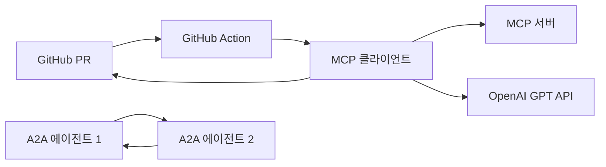

# CodeSage 경량 MCP 및 A2A 스터디 프로젝트 제안서 및 설계 문서

## 요약
CodeSage 경량 프로젝트는 1-2명의 개발자가 예산 없이 OpenAI의 GPT API를 활용하여 MCP(Model Context Protocol)와 A2A(Agent2Agent Protocol)를 중심으로 스터디를 진행할 수 있도록 설계되었습니다. MCP를 통해 AI 모델이 코드 변경 사항에 접근하고 리뷰 코멘트를 생성하며, A2A를 통해 간단한 에이전트 간 통신을 구현합니다. 이 프로젝트는 학습에 중점을 두며, GitHub Actions를 통해 PR에 자동으로 코멘트를 게시하는 기본 기능을 제공합니다.

## 프로젝트 제안서

### 배경 및 목적
CodeSage는 원래 AI 기반 코드 리뷰 및 자동화 도구로, MCP와 A2A를 활용해 확장 가능한 시스템을 목표로 했습니다. 그러나 소규모 팀(1-2명)과 예산 제약을 고려하여, 스터디 중심의 경량 버전을 제안합니다. 이 프로젝트는 MCP와 A2A의 핵심 개념을 학습하고, OpenAI의 GPT API를 통합하여 코드 리뷰 자동화의 기본 기능을 구현합니다. 스터디의 핵심은 MCP를 통해 AI 모델에 코드 컨텍스트를 제공하고, A2A를 통해 에이전트 간 협력을 이해하는 데 있습니다.

### 문제 정의
소규모 팀은 복잡한 시스템 구현이 어렵고, 예산 없이 고급 AI 도구를 사용하는 데 제약이 있습니다. 또한, MCP와 A2A 같은 최신 프로토콜은 학습 곡선이 있어 초보 개발자에게 도전적입니다. 이 프로젝트는:
- 최소한의 리소스로 MCP와 A2A 학습.
- OpenAI GPT API를 활용한 실용적 구현.
- GitHub Actions를 통한 간단한 자동화 제공.

### 솔루션 개요
CodeSage 경량 버전은 두 가지 학습 경로로 구성됩니다:
1. **MCP 학습**: MCP Python SDK를 사용해 간단한 MCP 서버를 구축하고, 코드 diff를 리소스로 제공하여 GPT API로 리뷰 코멘트를 생성.
2. **A2A 학습**: Google A2A GitHub 저장소의 예제를 따라 두 에이전트 간 기본 통신을 구현, 에이전트 협력 개념 이해.

GitHub Action은 PR 생성 시 MCP 클라이언트를 호출하여 리뷰 코멘트를 생성하고 PR에 게시합니다. A2A는 별도의 스터디 모듈로, 간단한 에이전트 통신을 시뮬레이션합니다.

### 주요 기능
| **기능**                     | **설명**                                                                 |
|------------------------------|--------------------------------------------------------------------------|
| MCP 서버를 통한 코드 diff 제공 | MCP 서버가 PR의 코드 diff를 리소스로 노출.                                |
| AI 기반 리뷰 코멘트 생성      | MCP 클라이언트가 diff를 가져와 GPT API로 리뷰 코멘트 생성.                |
| PR에 코멘트 게시             | GitHub Action이 생성된 코멘트를 PR에 게시.                               |
| A2A 에이전트 통신            | 두 에이전트가 A2A 프로토콜로 메시지 교환, 협력 시뮬레이션.                |

### 기술 스택
- **프로그래밍 언어**: Python
- **MCP**: [MCP Python SDK](https://github.com/modelcontextprotocol/python-sdk)
- **A2A**: [Google A2A GitHub](https://github.com/google/A2A)
- **AI 모델**: [OpenAI GPT-3.5-turbo](https://platform.openai.com/docs/models)
- **CI/CD**: [GitHub Actions](https://docs.github.com/en/actions)
- **라이브러리**: `openai`, `requests`, `modelcontextprotocol`

### 프로젝트 범위
- **포함**:
  - MCP 서버 및 클라이언트 구현.
  - GPT API를 통한 리뷰 코멘트 생성.
  - GitHub Action 워크플로우.
  - A2A 기본 에이전트 통신 예제.
- **제외**:
  - 백엔드/프론트엔드 서버.
  - 데이터베이스.
  - 라인별 코멘트 생성.
  - 고급 보안/성능 테스트.

### 일정 및 마일스톤
| **단계**            | **기간**         | **활동**                                      |
|---------------------|------------------|-----------------------------------------------|
| 환경 설정           | 1주             | GitHub 저장소, OpenAI API 키, MCP SDK 설치.   |
| MCP 구현            | 2-3주           | MCP 서버/클라이언트, GPT 통합.                |
| A2A 구현            | 1-2주           | A2A 에이전트 예제 구현.                       |
| GitHub Action 통합  | 1주             | 워크플로우 설정, PR 코멘트 게시.              |
| 테스트 및 문서화    | 1주             | 기능 테스트, 학습 결과 문서화.                |

**총 기간**: 약 6-8주 (주당 10-15시간).

### 예산 및 자원
- **인력**: 1-2명 (초보/중급 개발자).
- **인프라**:
  - GitHub: 무료 계정.
  - OpenAI API: 무료 크레딧($5) 사용, 이후 소액 비용 가능.
- **예상 비용**:
  - 리뷰 1회(1000 입력 토큰 + 500 출력 토큰): 약 $0.00125.
  - 1000회 리뷰 시 $1.25, 무료 크레딧으로 초기 충분.
- **비용 관리**: [OpenAI 대시보드](https://platform.openai.com/usage)로 사용량 확인, 월 $1 예산 설정.

### 위험 및 완화 전략
| **위험**                     | **설명**                                           | **완화 전략**                              |
|------------------------------|----------------------------------------------------|--------------------------------------------|
| API 비용 초과                | 무료 크레딧 소진 후 비용 발생 가능.                 | 사용량 모니터링, 예산 제한.                |
| MCP/A2A 학습 곡선            | 초보자에게 복잡할 수 있음.                         | 공식 문서 및 튜토리얼 활용.                |
| 리뷰 품질 낮음               | GPT-3.5-turbo의 부정확한 코멘트 가능.              | 프롬프트 최적화, 테스트 강화.              |
| 워크플로우 오류               | GitHub Action 설정 실패 가능.                      | 디버깅 시간 확보, 로그 점검.               |

### 학습 목표
| **영역**         | **목표**                                           |
|------------------|----------------------------------------------------|
| MCP              | 서버/클라이언트 구현, AI 컨텍스트 제공 이해.       |
| A2A              | 에이전트 간 통신 원리 학습, 기본 구현.             |
| OpenAI API       | API 호출, 프롬프트 엔지니어링.                     |
| GitHub Actions   | 워크플로우 작성, CI/CD 개념 이해.                  |

## 소프트웨어 설계 문서

### 시스템 아키텍처
시스템은 두 개의 학습 모듈로 구성됩니다:
1. **MCP 모듈**:
   - MCP 서버: 코드 diff를 리소스로 제공.
   - MCP 클라이언트: diff를 가져와 GPT API로 리뷰 생성.
   - GitHub Action: PR 트리거로 클라이언트 호출, 코멘트 게시.
2. **A2A 모듈**:
   - 두 에이전트: 메시지 교환으로 협력 시뮬레이션.
   - 별도 실행, 학습 목적.

**아키텍처 다이어그램**:


### 데이터 설계
| **데이터**       | **설명**                                           |
|------------------|----------------------------------------------------|
| MCP 리소스       | 코드 diff (텍스트), MCP 서버에서 제공.              |
| 리뷰 코멘트      | GPT API 출력 (텍스트), PR에 게시.                  |
| A2A 메시지       | 에이전트 간 JSON 메시지, 학습용.                   |

### 인터페이스 설계
| **인터페이스**   | **설명**                                           |
|------------------|----------------------------------------------------|
| MCP 서버         | JSON-RPC 2.0, `get_diff` 리소스 제공.              |
| GitHub API       | `GET /pulls/{number}`, `POST /issues/{number}/comments`. |
| OpenAI API       | `POST /chat/completions`, 리뷰 생성.                |
| A2A 프로토콜     | JSON 기반 메시지 교환, Google A2A 사양 준수.        |

### 모듈 설계
| **모듈**           | **책임**                                           |
|--------------------|----------------------------------------------------|
| MCP 서버           | 코드 diff 리소스 제공.                             |
| MCP 클라이언트     | diff 가져오기, GPT 호출, 코멘트 생성.              |
| GitHub Action      | PR 감지, 클라이언트 실행, 코멘트 게시.             |
| A2A 에이전트       | 메시지 송수신, 협력 시뮬레이션.                    |

### 구현 세부 사항
#### MCP 모듈
- **MCP 서버**:
  - [MCP Python SDK](https://github.com/modelcontextprotocol/python-sdk) 설치.
  - 리소스 정의: `get_diff` (PR 번호 입력, diff 텍스트 출력).
  - JSON-RPC 2.0으로 요청 처리.
- **MCP 클라이언트**:
  - 서버에 `get_diff` 요청.
  - diff로 GPT 프롬프트 생성: "코드 변경 사항을 검토하고 피드백 제공: {diff}".
  - GPT-3.5-turbo 호출, 최대 500 토큰 출력.
- **GitHub Action**:
  - PR 생성 시 트리거.
  - 클라이언트 실행, 코멘트 게시.

#### A2A 모듈
- **에이전트 1**: 메시지 전송 (예: "리뷰 요청").
- **에이전트 2**: 응답 생성 (예: "리뷰 완료").
- Google A2A 사양 따라 JSON 메시지 교환.
- 로컬 실행, HTTP 기반 통신.

### 샘플 코드
#### MCP 서버

```python
from modelcontextprotocol import FastMCPServer
import json

class CodeSageMCPServer(FastMCPServer):
    async def get_diff(self, pr_number: str) -> str:
        # GitHub API로 diff 가져오기 (예시)
        diff = (
            "diff --git a/file.py b/file.py\n"
            "--- a/file.py\n"
            "+++ b/file.py\n"
            "@@ -1 +1 @@\n"
            "- print('Hello')\n"
            "+ print('Hello, World!')"
        )
        return diff

server = CodeSageMCPServer()
server.register_resource("get_diff", server.get_diff)
server.run(host="localhost", port=8000)

```


#### MCP 클라이언트 및 GitHub Action 스크립트
```python
import os
import requests
from openai import OpenAI
from modelcontextprotocol import MCPClient

# 환경 변수
repo = os.getenv('GITHUB_REPOSITORY')
pr_number = os.getenv('GITHUB_REF').split('/')[-2]
github_token = os.getenv('GITHUB_TOKEN')
openai_api_key = os.getenv('OPENAI_API_KEY')

# MCP 클라이언트
client = MCPClient("http://localhost:8000")
diff = client.call_resource("get_diff", pr_number)

# OpenAI 클라이언트
openai_client = OpenAI(api_key=openai_api_key)
prompt = f"다음 코드 변경 사항을 검토하고 보안, 성능, 품질 측면에서 피드백을 제공하세요:\n\n{diff}"
response = openai_client.chat.completions.create(
    model="gpt-3.5-turbo",
    messages=[{"role": "user", "content": prompt}],
    max_tokens=500
)
review_comment = response.choices[0].message.content

# GitHub 코멘트 게시
headers = {
    'Authorization': f'Bearer {github_token}',
    'Accept': 'application/vnd.github.v3+json'
}
comment_url = f"https://api.github.com/repos/{repo}/issues/{pr_number}/comments"
comment_data = {'body': review_comment}
requests.post(comment_url, headers=headers, json=comment_data)
```

#### GitHub Action 워크플로우
```yaml
name: CodeSage Review

on:
  pull_request:
    types: [opened, synchronize]

jobs:
  review:
    runs-on: ubuntu-latest
    steps:
      - name: Checkout code
        uses: actions/checkout@v3

      - name: Set up Python
        uses: actions/setup-python@v4
        with:
          python-version: '3.x'

      - name: Install dependencies
        run: |
          pip install openai requests modelcontextprotocol

      - name: Run MCP server
        run: |
          python mcp_server.py &
          sleep 5

      - name: Run code review script
        env:
          OPENAI_API_KEY: ${{ secrets.OPENAI_API_KEY }}
          GITHUB_TOKEN: ${{ secrets.GITHUB_TOKEN }}
        run: python code_review.py
```

#### A2A 에이전트 예제
```python
import requests
import json

class A2AAgent:
    def __init__(self, name, endpoint):
        self.name = name
        self.endpoint = endpoint

    def send_message(self, recipient_endpoint, message):
        payload = {
            "sender": self.name,
            "message": message
        }
        response = requests.post(recipient_endpoint, json=payload)
        return response.json()

    def receive_message(self, payload):
        return {"response": f"{self.name} received: {payload['message']}"}

# 에이전트 실행 (예시)
agent1 = A2AAgent("Agent1", "http://localhost:9000")
agent2 = A2AAgent("Agent2", "http://localhost:9001")
response = agent1.send_message(agent2.endpoint, "Review requested")
print(response)
```

### 보안 설계
- **API 키 보호**: `OPENAI_API_KEY`, `GITHUB_TOKEN`은 GitHub Secrets에 저장.
- **MCP 보안**: 로컬 서버로 제한, 외부 접근 차단.
- **A2A 보안**: 학습용으로 HTTP 사용, 실제 배포 시 TLS 추가.
- **입력 제한**: diff 크기 4000 토큰 이하로 제한.

### 테스트 전략
| **테스트 유형** | **방법**                          | **설명**                                      |
|-----------------|-----------------------------------|-----------------------------------------------|
| MCP 테스트      | 로컬 서버/클라이언트 실행         | diff 제공 및 리뷰 생성 확인.                  |
| A2A 테스트      | 에이전트 메시지 교환              | 메시지 송수신 성공 여부 점검.                 |
| GitHub 테스트   | 테스트 PR 생성                    | 코멘트 게시 확인.                             |
| 오류 테스트     | 잘못된 키 또는 대형 diff 사용     | 오류 처리 점검.                               |

### 배포 계획
- **환경**: GitHub 저장소.
- **설치**:
  1. 저장소 생성.
  2. OpenAI API 키를 [OpenAI 플랫폼](https://platform.openai.com)에서 획득, Secrets에 저장.
  3. 워크플로우 및 스크립트 업로드.
  4. 테스트 PR로 동작 확인.
- **모니터링**: GitHub Actions 로그, OpenAI 사용량 확인.

### 학습 및 확장 가능성
| **영역**         | **성과**                                           |
|------------------|----------------------------------------------------|
| MCP              | 서버/클라이언트 구현, AI 컨텍스트 제공 학습.       |
| A2A              | 에이전트 통신 구현, 협력 원리 이해.                |
| 확장            | 피드백 저장, 라인별 코멘트, 고급 모델 도입 가능.   |

### 제한 사항
- **리뷰 품질**: GPT-3.5-turbo의 코드 특화 부족.
- **MCP 복잡성**: 초보자에게 설정 어려움 가능.
- **A2A 단순화**: 학습용으로 제한, 실제 배포 미포함.

## 결론
CodeSage 경량 프로젝트는 MCP와 A2A를 중심으로 한 스터디에 최적화된 솔루션입니다. MCP를 통해 AI와 코드 데이터를 연결하고, A2A로 에이전트 협력을 학습하며, 소규모 팀이 예산 없이 실질적인 경험을 쌓을 수 있습니다.

테스트용 PR 입니다.